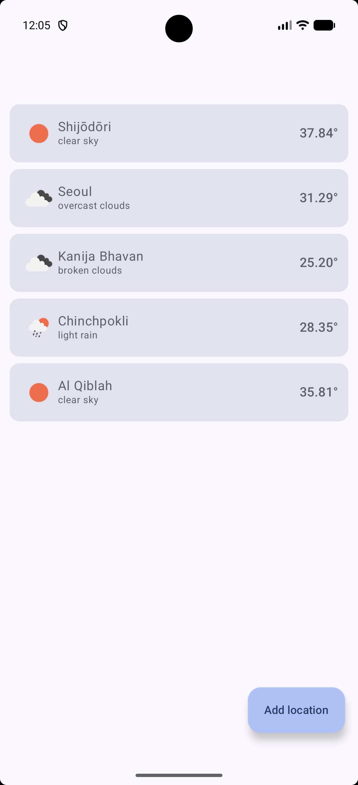
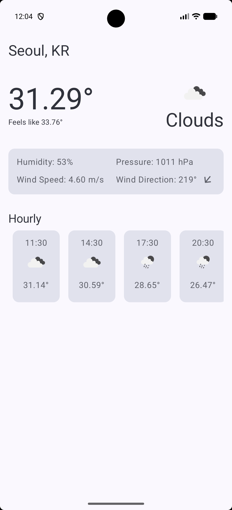
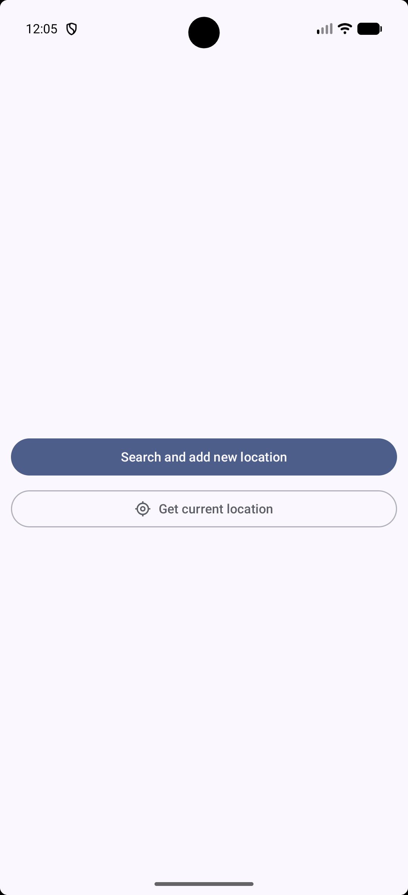

# Atmosense

Atmosense is a modern Android weather application built with a focus on Clean Architecture,
multi-module structure, and the latest Jetpack Compose technologies.

## 🚀 Features

- Current weather information based on location or search.
- 5-day / 3-hour weather forecast.
- City management and search functionality.
- Offline support using SQLDelight.
- Modern UI with Jetpack Compose and Material 3.

## 📸 Screenshots

|                   Home                   |                   City Details                   |                  Empty State                   |
|:----------------------------------------:|:------------------------------------------------:|:----------------------------------------------:|
|  |  |  |

## 🏗️ Architecture

The project follows a **Multi-module Clean Architecture** approach to ensure scalability,
testability, and separation of concerns.

### Module Breakdown

- **`:app`**: The main entry point, containing the DI root and UI implementation.
- **`:core:domain`**: Pure Kotlin module containing Business Logic, Entities, and Use Cases.
- **`:core:data`**: Implementation of repositories, handling data orchestration between network and
  database.
- **`:core:network`**: Ktor-based networking layer for fetching data from OpenWeatherMap.
- **`:core:database`**: SQLDelight-based local persistence layer.
- **`:core:location`**: Service for handling device location updates.
- **`:core:common`**: Shared utilities and base classes used across modules.

### Tech Stack

- **UI**: [Jetpack Compose](https://developer.android.com/jetpack/compose) with Material 3.
- **Navigation & State**: [Circuit](https://github.com/slackhq/circuit) for MVI-inspired
  architecture and navigation.
- **DI**: [Metro](https://github.com/zsweers/metro) for compile-time dependency injection.
- **Networking**: [Ktor](https://ktor.io/) for asynchronous HTTP requests.
- **Database**: [SQLDelight](https://cashapp.github.io/sqldelight/) for type-safe SQLite database.
- **Concurrency**: Kotlin Coroutines & Flow.
- **Date/Time**: `kotlinx-datetime`.

## 🛠️ Setup & Installation

### Prerequisites

- **Android Studio Ladybug (2024.2.1)** or newer.
- **JDK 21**.

### API Key Configuration

This app uses the **OpenWeatherMap API**. To run the project, you need to provide your own API key:

1. Sign up at [OpenWeatherMap](https://openweathermap.org/api) to get a free API key.
2. Add the key to your global `gradle.properties` file:

- **Windows**: `C:\Users\<YourUser>\.gradle\gradle.properties`
- **macOS/Linux**: `~/.gradle/gradle.properties`

3. Add the following line:
   ```properties
   OWM_API_KEY=your_api_key_here
   ```
   *Alternatively, you can add it to the project's root `gradle.properties` file.*

### Build & Run

1. Clone the repository.
2. Open the project in Android Studio.
3. Wait for Gradle sync to complete.
4. Run the `app` module on an emulator or physical device.

## 📝 Assumptions & Notes

- **API Usage**: The app assumes a valid OpenWeatherMap 2.5 API key. Note that some endpoints might
  require specific subscription tiers if using newer API versions (e.g., OneCall 3.0).
- **Permissions**: The app requires `ACCESS_COARSE_LOCATION` or `ACCESS_FINE_LOCATION` for local
  weather and `INTERNET` access.
- **Device Support**: Optimized for Android 11 (API 30) and above, with a minimum SDK of 24.
